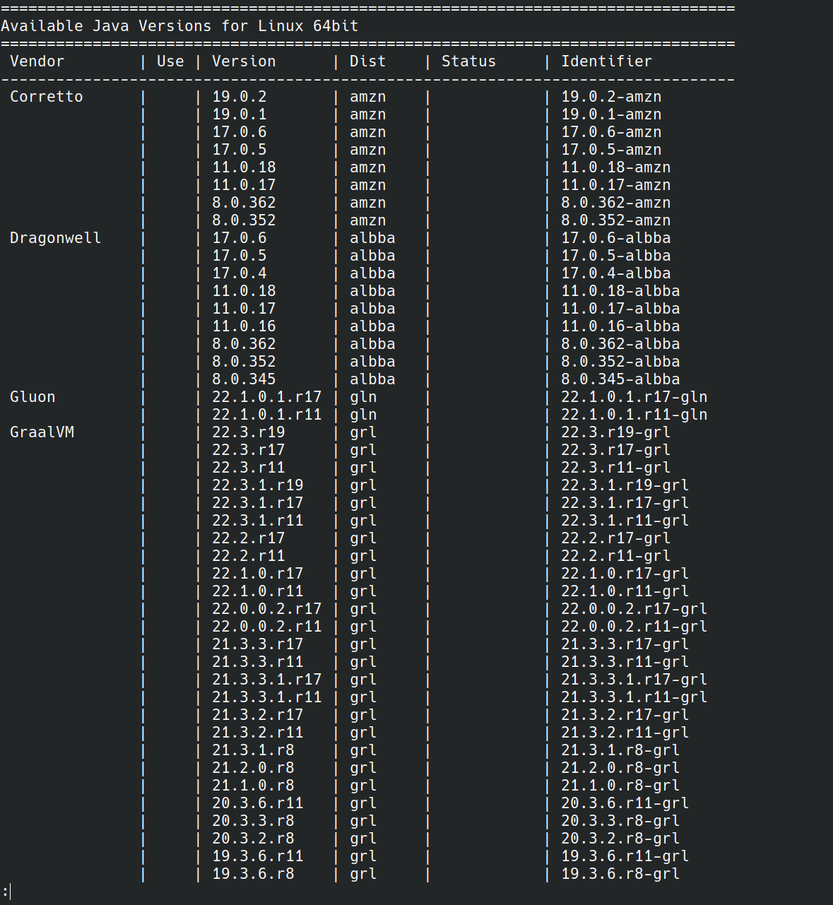

# For MacOS

## Check Java Environment
Open a terminal and run the following command:
```bash
java -version
```
It should return something like this:
```bash
java 17.0.8 2023-07-18 LTS
Java(TM) SE Runtime Environment (build 17.0.8+9-LTS-211)
Java HotSpot(TM) 64-Bit Server VM (build 17.0.8+9-LTS-211, mixed mode, sharing)
```
If it doesn't, install Java by following the instructions:

The easiest option is to use sdkman; it makes it easy to install and switch between installations of Java/Gradle. Follow the steps as listed on the website to get it installed:
https://sdkman.io/

then:

Find the possible versions you can install via
```bash
sdk list java
```
e.g. output 


Choose the version to install. For the sake of this guide I'll install OpenJDK 17.0.8: 
```bash
sdk install java 17.0.2-open
```
Set it as your default JDK:
```bash
sdk default java 17.0.8-open
```

Once it's installed, check the version again to make sure it's installed correctly:
```bash
java -version
```

## Run the executable file
Now, you have the Java environment set up. It's time to open the executable file.
Once you have downloaded the directory, open a terminal and navigate to the directory.
Usually, it's in the Downloads folder:
```bash
cd Downloads/HexaChordPackage
```
Then, run the following command:
```bash
chmod +x lunch.sh
```
This command gives the executable file permission to run.
Finally, run the executable file:
```bash
./lunch.sh
```
Voila! You should see the HexaChord GUI pop up.

# For Windows

## Check Java Environment
Open a cmd powershell and run the following command:
```bash
java -version
```
It should return something like this:
```bash
java 17.0.8 2023-07-18 LTS
Java(TM) SE Runtime Environment (build 17.0.8+9-LTS-211)
Java HotSpot(TM) 64-Bit Server VM (build 17.0.8+9-LTS-211, mixed mode, sharing)
```
If it doesn't, install Java by following the instructions:

In Windows you can use the chocolatey package manager:https://chocolatey.org/

After you install it, run in cmd/powershell:

Install OpenJDK 17:
```bash
choco install openjdk --version=17.0.8
```

## Run the executable file
This is way easier than MacOS. Open the downloaded directory "HexaChord" and double click the HexaChord.bat file.
Voila! You should see the HexaChord GUI pop up.